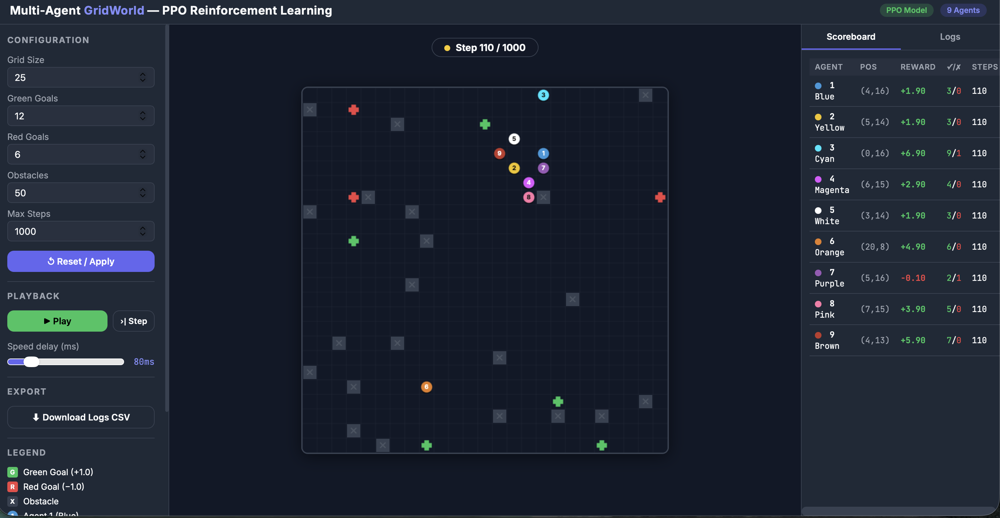
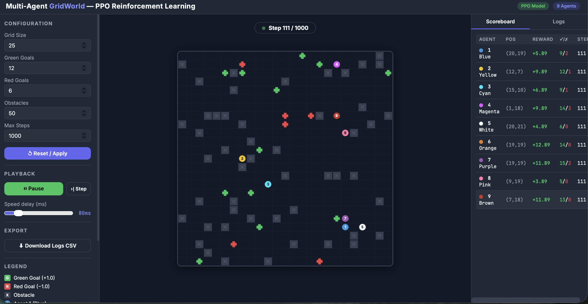

# 🧠 GridWorld Reinforcement Learning with PPO

<p align="center">
  
  
  
  
  
</p>

<p align="center">
  <b>An intelligent Reinforcement Learning agent that autonomously navigates a GridWorld environment using the Proximal Policy Optimization (PPO) algorithm, with an interactive Flask-based web interface.</b>
</p>

---

## 📖 Overview

This project demonstrates how **Reinforcement Learning (RL)** can be used to train an intelligent agent to navigate a **GridWorld** environment. The agent is trained using the **Proximal Policy Optimization (PPO)** algorithm and can be visualized through a **Flask-based web interface**.

### 🎯 Key Objectives
- Train an autonomous agent using PPO.
- Provide an interactive visualization of the agent’s behavior.
- Offer a modular and extensible environment for experimentation.
- Serve as an educational and research tool for Reinforcement Learning.

---

## 🚀 Features

### 🎮 Custom GridWorld Environment
- Configurable **grid size**, **obstacles**, **goals**, and **penalties**.
- Deterministic and extensible design.
- Ideal for experimentation and academic demonstrations.

### 🤖 PPO Reinforcement Learning Agent
- Implementation of the **Proximal Policy Optimization (PPO)** algorithm.
- Supports both **standard** and **CNN-based** policies.
- Includes **pre-trained models** for immediate testing.

### 🌐 Interactive Web Interface
- Built with **Flask** for real-time interaction.
- Visualizes agent movements and environment states.
- Simple and user-friendly browser interface.

### 📊 Training & Replay
- Complete training pipeline.
- Replay functionality to analyze agent behavior.
- Easy experimentation with different parameters.

---

## 📁 Project Structure

Grid-world/
│
├── app.py # Flask web application

├── env.py / gridworld.py # Environment logic

├── ppo.py # PPO algorithm implementation

├── train.py # Script to train the PPO agent

├── play.py # Run the trained agent

├── ppo_agent.pth # Pre-trained PPO model

├── ppo_cnn_agent.pth # CNN-based PPO model

├── replay.json # Stored gameplay or training replay

├── templates/

│ └── index.html # Web interface template

├── requirements.txt # Python dependencies

├── .gitignore # Ignored files and folders

└── README.md # Project documentation


---
## 📸 Screenshots

### 🖼️ Image 1


### 🖼️ Image 2


### 🖼️ Image 3


---


## 🛠️ Quick Start (All-in-One Setup)

Run the following commands to set up the project, install dependencies, and launch the application:

```bash
# Clone the repository
git clone https://github.com/nischaysh786-wq/Grid-world.git
cd Grid-world

# Create and activate a virtual environment
python3 -m venv venv
source venv/bin/activate          # macOS/Linux
# venv\Scripts\activate           # Windows

# Upgrade pip and install dependencies
pip install --upgrade pip
pip install -r requirements.txt || pip install flask torch numpy

# (Optional) Train the PPO agent
python train.py

# Run the trained agent via CLI
python play.py

# Launch the Flask web application
python app.py


---

## 🛠️ Quick Start (All-in-One Setup)

Run the following commands to set up the project, install dependencies, and launch the application:

```bash
# Clone the repository
git clone https://github.com/nischaysh786-wq/Grid-world.git
cd Grid-world

# Create and activate a virtual environment
python3 -m venv venv
source venv/bin/activate          # macOS/Linux
# venv\Scripts\activate           # Windows

# Upgrade pip and install dependencies
pip install --upgrade pip
pip install -r requirements.txt || pip install flask torch numpy

# (Optional) Train the PPO agent
python train.py

# Run the trained agent via CLI
python play.py
# Launch the Flask web application
python app.py


---
##| File                | Description                        |
| ------------------- | ---------------------------------- |
| `ppo_agent.pth`     | Pre-trained PPO model              |
| `ppo_cnn_agent.pth` | CNN-based PPO model                |
| `replay.json`       | Stored gameplay or training replay |

---
| File                | Description                        |
| ------------------- | ---------------------------------- |
| `ppo_agent.pth`     | Pre-trained PPO model              |
| `ppo_cnn_agent.pth` | CNN-based PPO model                |
| `replay.json`       | Stored gameplay or training replay |


